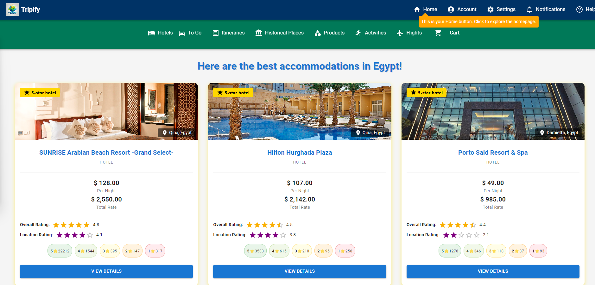
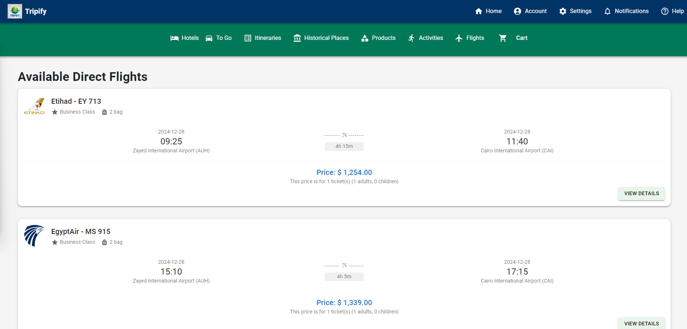
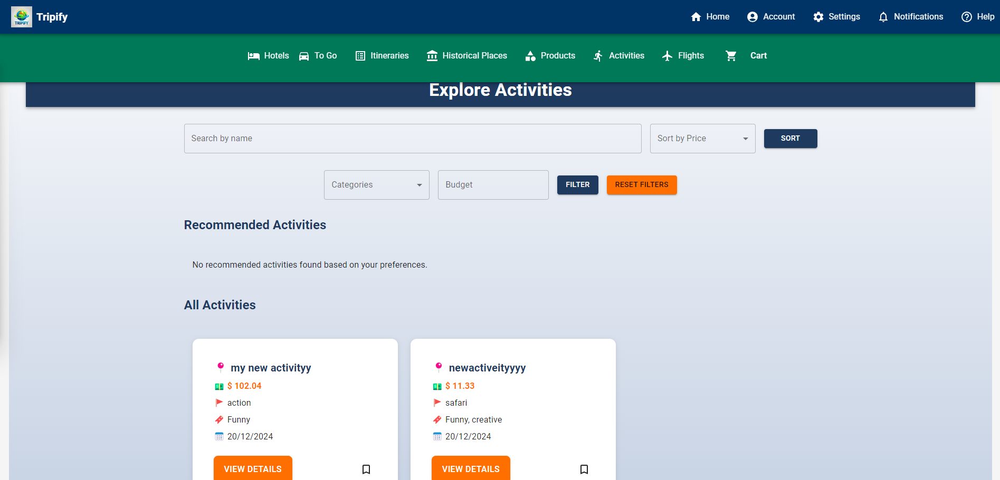
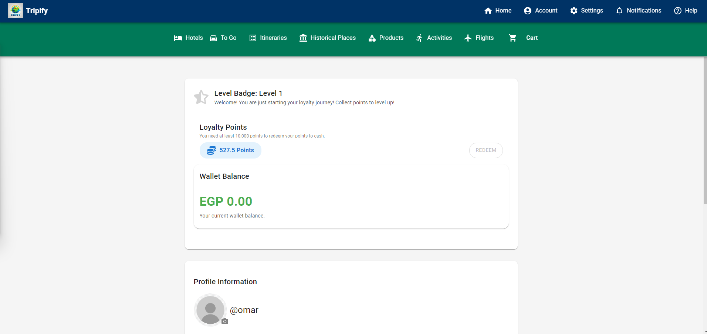
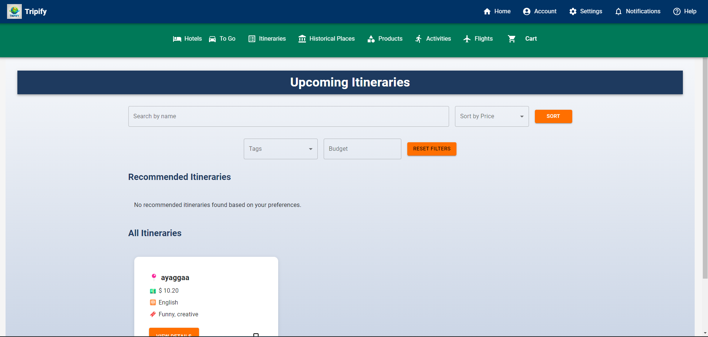

# Tripify

## Insights About Tripify

### 1. Uniqueness and Usefulness:
Tripify is a one-of-a-kind platform tailored specifically to streamline and enhance the experience of planning a trip to Egypt. By integrating a comprehensive suite of services—hotel bookings, flight reservations, activity & itinerary booking, and even product ordering—Tripify becomes the ultimate one-stop shop for tourists. The platform doesn't just make trip planning easier; it transforms it into a seamless, enjoyable process.

What makes Tripify stand out is its focus on the **entire travel journey**:
- From pre-trip arrangements like flights and hotels to in-trip conveniences like activity bookings and product deliveries.
- Post-trip features like rating tour guides ensure continuous improvement and trust within the travel community.

This end-to-end approach ensures travelers save time, reduce stress, and maximize their experience in Egypt.

### 2. Technological Solutions to Complex Problems:
Tripify harnesses a range of modern technologies to tackle the multifaceted challenges of travel planning:
- **Dynamic Itinerary Management**: An intelligent scheduling system allows users to organize their trip in a way that balances personal preferences and logistical feasibility.
- **Personalized Recommendations**: By analyzing user preferences and historical data, the platform suggests tailored activities, products, and accommodations.
- **Integrated Booking System**: A seamless connection with hotel, flight, and activity providers ensures real-time availability and secure bookings.
- **User Ratings and Reviews**: Tour guides can be rated and reviewed, creating a feedback loop that encourages quality service and helps users make informed choices.
- **E-commerce Integration**: A built-in product ordering system provides convenience, offering access to travel essentials and souvenirs.

### 3. What Makes Tripify Different:
Unlike generic travel platforms, Tripify focuses specifically on Egypt, delivering a localized experience with insights into the country's culture, history, and unique attractions. This laser-focused approach ensures:
- **Tailored content and recommendations** relevant to Egypt’s rich tourism offerings.
- **Partnerships with local businesses**, providing authentic and unique experiences.
- A platform that understands the **nuances of traveling in Egypt**, from navigating language barriers to accessing local expertise.

## Build Status

### 1. **Server Build Status**
- **Test Coverage**: All tests have passed successfully, including unit, integration, and end-to-end tests.
- **Performance**: Verified for optimal performance with benchmark tests, ensuring low latency and high availability.
- **Error Handling**: Error logging is functional, with alerts set up to notify the team about any critical server issues.

### 2. **Client Build Status**
- **Dependency Management**: All required dependencies are resolved and up-to-date.
- **Dynamic Rendering**: While most pages load correctly on the first attempt, certain pages require a manual refresh to adjust layouts dynamically. This behavior is being tracked and has been prioritized for resolution.
- **Responsive Design**:Responsive design is yet to be implemented in future updates.
- **Known Issues**:
  - Page layout rendering issue on initial load for specific pages.
  - Certain transitions may experience minor lag in low-bandwidth environments.

### 3. **Planned Improvements**
- Implementing a client-side state management update to handle dynamic layout rendering without requiring a refresh.
- Enhancing pre-rendering capabilities using React's `useEffect` hooks for smoother initial loads.
- Integrating more robust testing for edge cases in layout rendering.
- Expanding browser compatibility to support older versions of Internet Explorer and Safari.

## Code Style and Architecture

## Server (Backend)
The backend server is built using **Node.js** and follows the **MVC (Model-View-Controller)** architecture, ensuring clean and maintainable code. It is part of the **MERN stack** and utilizes the following core components:

- **Node.js**: Provides a runtime environment for executing server-side code.
- **Express.js**: A web framework used for creating robust APIs and managing routing and middleware.
- **MongoDB**: A NoSQL database used for storing and managing application data, with **Mongoose** as the Object Data Modeling (ODM) library for MongoDB.

### Directory Structure
The server is structured into the following components:

- **Models**:
  - Located in the `models` folder.
  - Define the schema and handle database interactions using **Mongoose**.

- **Controllers**:
  - Located in the `controllers` folder.
  - Handle the core business logic and interact with models to process and retrieve data.

- **Routes**:
  - Located in the `routes` folder.
  - Define API endpoints and map them to the corresponding controller functions using **Express.js**.

- **Middlewares**:
  - Located in the `middlewares` folder.
  - Handle tasks such as authentication, validation, and error handling.

This combination of technologies and structure makes the backend robust, scalable, and efficient.


### Client (Frontend)
The client is built using **React**, following a modular structure to ensure reusability and maintainability.

- **Components**:
  - Located in the `src/components` folder.
  - Contain reusable UI elements such as buttons, headers, and cards.

- **Pages**:
  - Located in the `src/pages` folder.
  - Represent specific screens or routes in the application, such as the homepage or booking page.

- **Services**:
  - Located in the `src/services` folder.
  - Handle all API calls to the backend.

- **Utils**:
  - Located in the `src/utils` folder.
  - Contain helper functions and utilities to be used across the application.

This separation of concerns ensures a clean and organized codebase, allowing for easier debugging, testing, and scalability.

---


## Features

### Core Functionality
1. **Flight Booking**: 
   - Search for flights with filters for price, duration, and airline preferences.
   - View detailed flight schedules and seat availability.
   - Book flights directly through the platform with secure payment options.

2. **Hotel Reservations**:
   - Discover top-rated hotels and resorts in Egypt.
   - Use filters for price, location, and amenities to find the perfect stay.
   - View room availability in real-time and reserve instantly.

3. **Activities and Attractions**:
   - Explore a curated list of local activities, tours, and attractions.
   - Check availability, pricing, and ratings before booking.
   - Book activities directly with instant confirmation.

4. **Tour Guide Ratings and Bookings**:
   - View detailed profiles of tour guides, including ratings and reviews from other users.
   - Book guides for personalized tours based on your preferences.
   - Rate and review your experience to help others make informed choices.

5. **Product Store**:
   - Browse and purchase travel-related products, including souvenirs, gear, and accessories.
   - Personalized recommendations based on your trip itinerary and preferences.

### User Management
1. **User Registration**:
   - Tourists, tour guides, advertisers, and sellers can register using email, username, and password.
   - Role-specific functionalities tailored for each user type.

2. **Authentication**:
   - Secure login using username and password.
   - Two-factor authentication for enhanced security.

3. **Password Management**:
   - Change passwords anytime through the profile settings.
   - Reset passwords securely using OTP-based email verification.

### Guest Access
- Browse flights, hotels, and activities without registering.
- Upgrade to a registered account to unlock booking and advanced features.

### Notifications
- Receive real-time updates for flight, hotel, and activity bookings.
- Get reminders for upcoming trips and promotional offers.

### Virtual Trip Planner
- Plan itineraries with a virtual assistant that suggests optimized travel routes.
- Integration with maps to view travel distances and routes.

### Reviews and Feedback
- In-depth rating and review system for flights, hotels, activities, and tour guides.
- Publicly visible reviews to help other users make informed decisions.

---

## Code Examples

### Backend Route Example
The backend routes are defined using **Express.js**, where middleware is used for validation and controllers manage the business logic.

```javascript
import express from "express";
import { login, signup, logout } from "../controllers/user/user.auth.controller.js";
import { validate } from "../middlewares/validation.middleware.js";
import { loginSchema } from "../validation/users.auth.validation.js";

const router = express.Router();

// Authentication Routes
router.post("/access/user/login", validate(loginSchema, "body"), login);
router.post("/access/user/signup", signup);
router.post("/access/user/logout", logout);
// Further continuation 
export default router;
```

### Backend Controller Example
This controller handles user login with validations, error handling, and status management.

```javascript
export const login = async (req, res) => {
  try {
    const { username, password } = req.body;

    const currentUser = await User.findOne({ username });
    if (!currentUser) {
      return res.status(404).json({ message: "User not found." });
    }

    if (currentUser.password !== password) {
      return res.status(401).json({ message: "Invalid password." });
    }

    // Check user type and status
    const allowedTypes = ["Seller", "Advertiser", "Tour Guide"];
    if (allowedTypes.includes(currentUser.type) && currentUser.status !== "Accepted") {
      return res.status(403).json({ message: "Your account is not approved for login." });
    }

    console.log(currentUser);

    res.status(200).json({ message: "Login successful", user: currentUser });
  } catch (err) {
    console.error(err);
    res.status(500).json({ message: "Server error", error: err.message });
  }
};
```
### Backend Model Example
This example demonstrates how the model's schema was created and intialized. We will take at the user Model. 
```javascript
import mongoose from "mongoose";
const Schema = mongoose.Schema;

const userSchema = new mongoose.Schema({
  username: {
    type: String,
    required: true,
    unique: true,
  },
  email: {
    type: String,
  },
  password: {
    type: String,
    required: true,
  }, // Password of the user
  type: {
    type: String,
    enum: ["Tourist", "Tour Guide", "Admin", "Seller", "Tourism Governor", "Advertiser"], // Possible user roles
    required: true,
  },
  hasAcceptedTerms: {
    type: Boolean,
    default: false, // Default to false, indicating they haven't accepted yet
  },
  joinDate: {
    type: Date,
    default: Date.now, // Automatically sets the current date and time when the user is created
  },
  firstLogin: {
    type: Boolean,
    default: true,
  },
});

const User = mongoose.model("User", userSchema);
export default User;
```
### Frontend Profile Page Example
This example demonstrates how the user's profile is initialized in the frontend, using React with hooks for state and effects.

```javascript
const TouristProfile = () => {
  const navigate = useNavigate();
  const userId = getUserId();
  const [userProfile, setUserProfile] = useState(null);
  const [isEditing, setIsEditing] = useState(false);
  const [redeemSuccess, setRedeemSuccess] = useState(false);
  const [profilePicUrl, setProfilePicUrl] = useState("");
  const [vacationOptions, setVacationOptions] = useState([]);
  const [addresses, setAddresses] = useState([]);
  const [loadingAddresses, setLoadingAddresses] = useState(true);

  const [formData, setFormData] = useState({
    username: "",
    email: "",
    firstName: "",
    lastName: "",
    phoneNumber: "",
    nationality: "",
    birthDate: "",
    occupation: "",
    gender: "",
    currency: "",
    preferences: [],
  });

  const countries = [
    "USA", "Canada", "UK", "Germany", "France", "Australia", "Egypt", "Italy", 
    "Spain", "Brazil", "Argentina", "Mexico", "India", "China", "Japan", 
    "South Korea", "Saudi Arabia", "United Arab Emirates"
  ];

  useEffect(() => {
    const fetchProfile = async () => {
      try {
        const response = await getProfile(userId);
        const fullName = response.data.userProfile.name.split(" ");

        setUserProfile(response.data.userProfile);
        setFormData({
          username: response.data.userProfile.username,
          email: response.data.userProfile.email,
          firstName: fullName[0],
          lastName: fullName[1] || "",
          phoneNumber: response.data.userProfile.phoneNumber,
          nationality: response.data.userProfile.nationality,
          birthDate: response.data.userProfile.birthDate,
          occupation: response.data.userProfile.occupation,
          currency: response.data.userProfile.currency || "",
          gender: response.data.userProfile.gender || "",
          preferences: response.data.userProfile.preferences || [],
        });
      } catch (error) {
        console.error("Error fetching profile:", error);
      }
    };
    fetchProfile();
  }, [userId]);
};
// Further continuation 
```

### Frontend Service Example
This example shows how to handle file uploads in the frontend, using Axios to call the backend API.

```javascript
export const uploadFiles = async (formData) => {
  try {
    const response = await axios.post("http://localhost:8000/user/upload/documents", formData, {
      headers: { "Content-Type": "multipart/form-data" },
    });
    return response.data; // Return the response data from the API
  } catch (error) {
    console.error("File upload failed:", error);
    throw error; // Rethrow the error to handle it in the calling function
  }
};
```

---


## Installation and Setup

### Server Setup
1. Navigate to the server directory:
   ```bash
   cd Tripify3/Server
   ```
2. Install dependencies:
   ```bash
   npm install
   ```
3. Start the server:
   ```bash
   npm run tripify
   ```

### Client Setup
1. Navigate to the client directory:
   ```bash
   cd Tripify3/Client
   ```
2. Install dependencies:
   ```bash
   npm install
   ```
3. Start the client:
   ```bash
   npm start
   ```

Once the client is running, the React app should open in your browser at [http://localhost:3000](http://localhost:3000).

---

## API References

The base address for the API is:
`http://localhost:8000`

Below is the complete list of all API routes:

- `GET /activity/get`
- `GET /tourist/activity/get/:userId`
- `GET /activity/get/:activityId`
- `PUT /activity/get/:id`
- `DELETE /activity/delete/:id`
- `PUT /activity/activate/:id`
- `GET /admin/getAllUsers`
- `GET /admin/findUser`
- `GET /users/accepted`
- `GET /users/pending`
- `DELETE /admin/user/delete/:id`
- `POST /admin/user/add`
- `POST /admin/category/create`
- `GET /categories/get`
- `PUT /admin/category/update`
- `DELETE /admin/category/delete`
- `PUT /user/update/status/:id`
- `GET /admin/complaint/get/:id`
- `PUT /admin/complaint/mark-status/:id`
- `PUT /activity/inappropriate/:id`
- `GET /payments/visa/completed`
- `POST /admin/promocode`
- `GET /get/non-admins`
- `PUT /advertiser/profile/:id`
- `GET /advertiser/profile/:id`
- `GET /advertiser/get`
- `DELETE /advertiser/delete/:advertiserId`
- `POST /advertiser/activity/create`
- `PUT /advertiser/activity/:advertiserId/:activityId`
- `GET /advertiser/activity/:advertiserId`
- `GET /advertiser/:id/activityRevenue`
- `PUT /activity/deactivate/:id`
- `GET /activity/get/bookings/:activityId`
- `POST /booking/create`
- `GET /bookings/get/:touristId`
- `GET /booking/get/tour-guide/profile/:tourGuideId/:touristId`
- `DELETE /booking/delete/:bookingId`
- `GET /booking/get/reviews/:booking/:tourist/:type/:itemId`
- `POST /complaint/create`
- `POST /admin/complaint/reply`
- `GET /complaints/get`
- `POST /itinerary/create`
- `GET /itineraries/get/tourGuide/:id`
- `GET /itineraries/get`
- `GET /itineraries/active/appropriate/get/:userId`
- `GET /itinerary/get/:id`
- `PUT /itinerary/update/:id`
- `PUT /itinerary/delete/:id`
- `POST /itinerary/:id/addActivity`
- `PUT /itinerary/inappropriate/:id`
- `PUT /itinerary/activate/:id`
- `PUT /itinerary/deactivate/:id`
- `GET /itinerary/get/bookings/:itineraryId`
- `GET /places/get`
- `GET /place/get/:id`
- `GET /access/seller/getSellerByUserName`
- `DELETE /seller/delete/:id`
- `GET /access/seller/find/seller`
- `GET /access/seller/viewSeller`
- `PUT /seller/profile/:id`
- `GET /access/seller/searchAllProducts`
- `GET /access/seller/searchAllArchivedProducts`
- `DELETE /access/seller/deleteProduct`
- `DELETE /access/seller/deleteAllProducts`
- `PUT /access/seller/addProdImage`
- `GET /access/seller/viewProductStockAndSales`
- `PUT /access/seller/archiveProduct`
- `PUT /access/seller/unarchiveProduct`
- `GET /access/seller/getSalesHistory`
- `POST /access/seller/create/product`
- `PUT /access/seller/editProduct`
- `GET /uploads/:sellerId/:filename`
- `DELETE /uploads/:sellerId/:filename`
- `GET /access/seller/SearchProductById`
- `GET /revenue/:sellerId`
- `GET /tag/get`
- `POST /tag/create`
- `DELETE /tag/delete/:id`
- `PUT /tag/update`
- `PUT /tourGuide/profile/:id`
- `GET /tourGuide/profile/:id`
- `GET /tourGuide/getAll`
- `DELETE /tourGuide/delete/:userId`
- `GET /tourGuide/:id/revenue`
- `POST /place/create`
- `PUT /governor/update/place/:id`
- `DELETE /governor/update/place/:id`
- `POST /governor/tag/create`
- `GET /tourist/profile/:id`
- `PUT /tourist/profile/:id`
- `GET /flights`
- `GET /hotels`
- `GET /directions`
- `GET /suggestions`
- `GET /activitiesAttended/get/:userId`
- `DELETE /tourist/delete/:id`
- `GET /tourist/complaints/:id`
- `POST /tourist/profile/:id/redeem`
- `POST /tourist/review`
- `GET /tourist/following/get/:touristId`
- `POST /tourist/follow/:touristId/:tourGuideId`
- `POST /initializeWishlist`
- `PUT /tourist/wishlist/Add`
- `GET /tourist/wishlist/get`
- `PUT /tourist/wishlist/remove`
- `POST /initializeCart`
- `PUT /tourist/cart/add`
- `GET /tourist/cart`
- `PUT /tourist/cart/remove`
- `PUT /tourist/cart/decrement`
- `PUT /tourist/cart/update`
- `PUT /tourist/booking/cancel`
- `PUT /tourist/itinerary/attend`
- `POST /tourist/booking/create`
- `GET /tourist/payment/config`
- `POST /tourist/create/payment/intent`
- `POST /tourist/create/payment`
- `POST /tourist/cancel/payment/intent`
- `POST /tourist/checkout`
- `GET /tourist/get/orders/:userId`
- `GET /validate-promo/:userId/:code`
- `POST /toggle-bookmark`
- `POST /tourist/add/address/:userId`
- `PUT /tourist/edit/address/:userId`
- `DELETE /tourist/delete/address/:userId`
- `GET /tourist/get/addresses/:userId`
- `GET /tourist/bookmarks/:userId`
- `POST /access/user/login`
- `POST /access/user/signup`
- `POST /access/user/logout`
- `POST /user/upload/documents`
- `PUT /user/upload/picture`
- `GET /user/files/:userId`
- `GET /user/profile/picture/:userId`
- `PUT /user/accept-terms/:id`
- `DELETE /user/remove/picture`
- `POST /user/resetPassword`
- `POST /user/sendVerificationCode`
- `POST /user/verifyVerificationCode`
- `GET /user/get/profile/:userId`
- `PUT /user/change/password`
- `DELETE /users/delete/:userId`
- `GET /user/get/profile/:id`
- `GET /get/notifications/:userId`
- `PUT /notifications/read/:userId`

---

## Testing

In this project, we employed a comprehensive approach to testing, covering both backend functionality and frontend rendering.

### Backend Testing with Postman

For backend testing, we used **Postman** to validate the functionality of the API routes. Postman allowed us to test various endpoints by sending HTTP requests and analyzing the responses. This helped ensure that the routes were functioning correctly, returning the expected results, and handling edge cases as anticipated.

We used Postman to:
- **Send GET, POST, PUT, DELETE requests**: We tested different HTTP methods to ensure that the API routes worked as expected for different use cases.
- **Verify status codes**: We confirmed that the correct HTTP status codes were returned for success, errors, and edge cases.
- **Check response data**: We validated that the returned data matched the expected structure, including correct data types and values.
- **Test authentication and authorization**: We tested the required headers, tokens, and authorization checks to ensure secure access to protected routes.

.jpeg>) 
.jpeg>) 
.jpeg>) 


By using Postman, we were able to simulate real-world API requests and verify that the backend functions as intended before integration with the frontend.

### Frontend Testing with Visual Judgment

For frontend testing, we used **visual judgment** to verify that the components rendered correctly and as expected. This involved:
- **Checking the appearance and layout**: We manually tested how components rendered on different devices and screen sizes to ensure they were responsive and visually appealing.
- **Validating component state**: We visually confirmed that components updated correctly when the state or props changed, such as verifying that form inputs, buttons, and dynamic content were behaving as expected.
- **Testing interactivity**: We clicked through the application to ensure that user interactions, such as clicks and form submissions, triggered the correct actions and displayed the expected results.

### Debugging and Handling Incorrect Logic

When encountering issues with logic or rendering:
- **Strong Debugging Skills**: We utilized browser developer tools and console logging to track down bugs and errors in both the frontend and backend. By closely inspecting the flow of data and the behavior of functions, we could identify and resolve issues efficiently.
- **Test-Driven Debugging**: When logic errors were detected, we applied test-driven debugging techniques by isolating specific functions or components and stepping through their execution to identify and correct the faulty logic.

---

## Tutorial

### Getting Started with Tripify:
If you're new to Tripify, we've prepared a comprehensive tutorial to guide you through all the features of the platform. The tutorial covers:

1. How to search for and book flights.
2. Reserving hotels and exploring available options.
3. Browsing and booking activities and attractions.
4. Using the virtual trip planner to book itinerary.
5. Checking out latest Products and order them.
6. Rating and reviewing our tourguides as well as any purchased products. 
6. Managing your profile, bookings, and reviews.

### Access the Tutorial:
- You can always review the tutorial by visiting the **Help & Support** section on the website, available in the main navigation bar. Look for the "Review Tutorial" option.


---
## Credits 

- `https://www.youtube.com/playlist?list=PLZlA0Gpn_vH_uZs4vJMIhcinABSTUH2bY`
- `https://www.youtube.com/watch?v=fgTGADljAeg`
- `https://www.youtube.com/playlist?list=PLZlA0Gpn_vH8EtggFGERCwMY5u5hOjf-h`
- `https://codedamn.com/news/reactjs/usestate-and-useeffect-hooks`

---

## License 

### Stripe
- We utilize Stripe to handle payment processing. Stripe provides a secure and reliable way to process payments and manage transactions. 

### SerpAPI
- We utilized SerpAPI for additional API functionality in our project (Third-party services)

---

## Screenshots 













